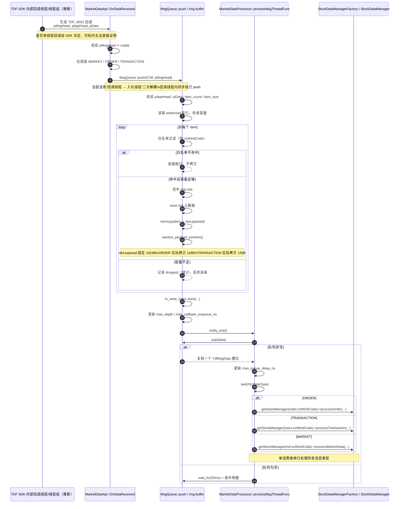

# 设计说明：行情生成与消费链路图 + 性能瓶颈分析 v8

> 目标：把当前 `TDF SDK → MsgQueue → MarketDataProcessor → StockDataManager` 的线程/时序关系画清楚，并标出最可能的性能瓶颈。
> 说明：本文基于当前代码实现整理；其中 “TDF SDK 是否单线程回调” 属于 SDK 外部行为，本文只做推断，不写成既定事实。

## 1. 结论摘要

- 当前实现是 **“SDK 回调线程内直接完成过滤 + 拷贝 + 入队，再由独立消费线程异步处理业务”**。
- 当前实现 **没有** 把 “SDK 接收” 和 “入队” 再拆成两层线程；`OnDataReceived()` 里直接调用 `MsgQueue::push()`。
- `MsgQueue::push()` 不是简单转发指针，而是在回调线程热路径里完成：
  - 消息类型过滤
  - 白名单过滤
  - 按 `item` 逐条拆包
  - `memcpy` 到 ring slot
  - payload 指针字段清洗
  - 更新写指针并 `notify_one`
- `MarketDataProcessor` 只有一条消费线程，`ORDER / TRANSACTION / MARKET` 三类消息共用同一条消费通道。

## 2. 线程 / 时序图

## 3. 代码已证实的实现事实

### 3.1 回调线程直接调用入队

- `MarketDataApi` 初始化时把 `settings.pfnMsgHandler` 设置为 `OnDataReceived()`。
- `OnDataReceived()` 仅保留 `MSG_DATA_TRANSACTION / MSG_DATA_ORDER / MSG_DATA_MARKET`，然后直接调用 `MsgQueue::getInstance().push(hTdf, pMsgHead)`。
- 这说明 **“SDK 接收”和“入队”并未额外解耦**。

### 3.2 push 在热路径里逐条拆包并深拷贝

- `MsgQueue::push()` 先校验 `pAppHead / pData / item_count / item_size`。
- 然后按 `item_count` 逐条循环：
  - 先做白名单过滤
  - 再做容量判断
  - 最后把单条记录写入 ring slot
- 每个 slot 都会写元数据，并把单条 payload 复制到 `slot.payload`。
- `sanitize_payload_pointers()` 会把 `pCodeInfo` 之类的指针清空，避免深拷贝后悬空。

### 3.3 单条 slot 的实际载荷大小

- `slot.payload` 固定上限为 `1024B`。
- `TDF_ORDER` 定义在 `#pragma pack(1)` 下，`x64` 目标下大小为 `118B`。
- `TDF_TRANSACTION` 定义在 `#pragma pack(1)` 下，`x64` 目标下大小为 `130B`。
- 这两类消息都远小于 `1024B`，因此当前不会因为 slot payload 太小而被丢弃。

### 3.4 消费端是单线程串行处理

- `main()` 中先启动 `MarketDataProcessor::startProcessThread()`，再连接行情。
- `processMsgThreadFunc()` 内部只有一条线程循环 `msgQueue.pop(data)`。
- `ORDER / TRANSACTION / MARKET` 在同一个 `switch` 里串行分发到 `StockDataManager`。

## 4. 可能的性能瓶颈与风险点

以下分析按优先级从高到低排序。

### 4.1 高优先级：回调线程热路径过重

**位置**

- `MarketDataApi::OnDataReceived()`
- `MsgQueue::push()`

**原因**

- 回调线程中同步执行 `push()`。
- `push()` 内又包含逐 item 循环、白名单判断、容量判断、`memcpy`、指针清洗、写索引更新与统计更新。

**触发条件**

- 行情峰值期 `item_count` 高
- 白名单命中率高，导致大部分 item 都要真正入队
- CPU 紧张或回调线程被其它逻辑抢占

**影响方向**

- 直接放大 SDK 回调耗时
- 放大 SDK → 本地队列 的接收抖动
- 极端情况下更容易出现队列积压和丢包

**现有可观测指标**

- `max_callback_enqueue_ns`
- `max_depth`
- `dropped_market / dropped_order / dropped_transaction`

### 4.2 高优先级：生产者并发模型存在结构性风险

**位置**

- `MsgQueue::push()`

**原因**

- 当前写入逻辑读取一次 `m_write_index`，最后直接 `store(write + actual_written)`。
- 没有 `CAS`，也没有 mutex 串行化多个生产者。
- 代码结构更像 **单生产者 / 单消费者** ring。

**触发条件**

- 若 TDF SDK 在多个线程并发触发 `OnDataReceived()`

**影响方向**

- 不同回调线程可能写到同一批 slot
- 最终写指针可能互相覆盖
- 表现可能是消息丢失、错乱或统计异常

**备注**

- 这是一个 **实现层面的结构性风险**。
- 是否真的会触发，取决于 TDF SDK 的回调线程模型；当前代码无法直接证明 SDK 一定单线程回调。

### 4.3 高优先级：单消费者串行处理所有消息类型

**位置**

- `MarketDataProcessor::processMsgThreadFunc()`

**原因**

- 所有 `ORDER / TRANSACTION / MARKET` 都在一条消费线程上串行处理。
- 后续又继续同步调用 `StockDataManagerFactory::getStockManager()` 和对应 `process*()`。

**触发条件**

- 某一只股票处理逻辑变重
- 某一类消息量陡增
- 下游 `StockDataManager` 内部存在较重计算或锁竞争

**影响方向**

- 任何一段慢处理都可能拖慢整条消费链路
- 队列延迟升高，`max_queue_delay_ns` 增大
- 生产速度持续大于消费速度时，最终反映为前端 push 丢包

**现有可观测指标**

- `max_queue_delay_ns`
- `max_depth`

### 4.4 中优先级：pop 存在二次大对象拷贝

**位置**

- `MsgQueue::pop()`

**原因**

- `data = m_ring[read & kMask]` 会复制整个 `TdfMsgData`。
- `TdfMsgData` 包含：
  - `TDF_MSG`
  - `TDF_APP_HEAD`
  - `enqueue_steady_ns`
  - `payload[1024]`
- 实际上很多时候有效载荷只有 `118B / 130B`，但复制的是整个 slot。

**影响方向**

- 增加缓存带宽压力
- 增加消费线程 copy 成本
- 在高频场景下放大 CPU 使用率

### 4.5 中优先级：队列满时策略是丢包，不是阻塞回调

**位置**

- `MsgQueue::push()`

**原因**

- ring 容量固定为 `1 << 16`。
- 满了以后逐条 `add_drop_stat()`，直接丢弃，而不是阻塞等待消费者追上。

**触发条件**

- 高频行情 + 消费不及

**影响方向**

- 优点是不会把 SDK 回调线程卡死
- 代价是高峰期会牺牲完整性
- 需要通过统计判断是否已经逼近容量极限

### 4.6 中优先级：白名单过滤位于回调热路径

**位置**

- `MsgQueue::push()`

**原因**

- 每个 item 在真正拷贝前都要先取 `szWindCode`，再做一次白名单判定。
- 当前判定通过 `std::string(szWindCode)` 构造临时对象再查 `unordered_set`。

**触发条件**

- 白名单较大
- 高频逐笔流 `item_count` 较高

**影响方向**

- 虽然白名单过滤可以减少无效入队，但本身也会占用回调线程 CPU
- 命中率低时，收益通常更大；命中率高时，过滤成本 + 拷贝成本都要承担

### 4.7 次优先级：等待粒度可能放大尾延迟

**位置**

- `MsgQueue::pop()`

**原因**

- 消费线程空队列时使用 `wait_for(50ms)`。
- 正常情况下依赖 `notify_one()` 及时唤醒。

**触发条件**

- 线程调度抖动
- 极端情况下通知丢失或消费者刚好错过检查窗口

**影响方向**

- 主要影响尾延迟，而不是吞吐上限
- 会让少量消息在队列里多躺一个调度周期

## 5. 现有统计字段与瓶颈对应关系

| 统计字段 | 含义 | 最能反映的问题 |
| --- | --- | --- |
| `max_callback_enqueue_ns` | 单次回调入队耗时峰值 | 回调热路径过重 |
| `max_depth` | 队列历史最大深度 | 生产 > 消费，积压 |
| `max_queue_delay_ns` | 消息从入队到出队的最长等待时间 | 消费线程跟不上 |
| `dropped_market` / `dropped_order` / `dropped_transaction` | 各类型丢弃条数 | 队列容量或吞吐不足 |
| `m_filtered_count` | 白名单过滤掉的消息数 | 源头过滤命中情况 |

## 6. 最优先关注的三个点

### 6.1 回调线程直接入队的热路径开销

- 这是当前实现最直接的吞吐瓶颈。
- 一旦行情 burst 到来，回调线程负担会线性放大。

### 6.2 单消费者串行处理

- 这是当前实现最直接的消费瓶颈。
- 任意下游慢路径都会反馈到队列深度和排队延迟上。

### 6.3 生产者并发安全假设

- 这是最需要先确认的正确性风险。
- 如果 SDK 回调不是单线程，该 ring 当前实现就可能存在数据竞争。

## 7. 建议的验证方式

### 7.1 用代码路径核对链路

- `market_data_api.cpp`
  - 回调注册
  - `OnDataReceived()` 直接调用 `MsgQueue::push()`
- `msg_queue.cpp`
  - `push()` 逐 item 入队
  - `pop()` 出队并复制 slot
- `market_data_processor.cpp`
  - 单线程循环消费
  - `switch` 分发到 `StockDataManager`

### 7.2 用现有统计做运行期验证

- 若 `max_callback_enqueue_ns` 明显偏高：优先怀疑回调热路径过重。
- 若 `max_depth` 和 `max_queue_delay_ns` 同时升高：优先怀疑消费者吞吐不足。
- 若 `dropped_*` 持续增长：说明生产速度已经长时间大于消费速度。
- 若在高压场景中出现“偶发乱序/缺失但 drop 不高”，需要优先排查是否存在多生产者并发写 ring 的风险。

## 8. 一句话结论

- 当前链路是 **“SDK 回调线程直接入队 + 单消费者线程串行消费”**。
- 性能瓶颈最优先看 **回调热路径、单消费者吞吐、生产者并发安全假设**。
